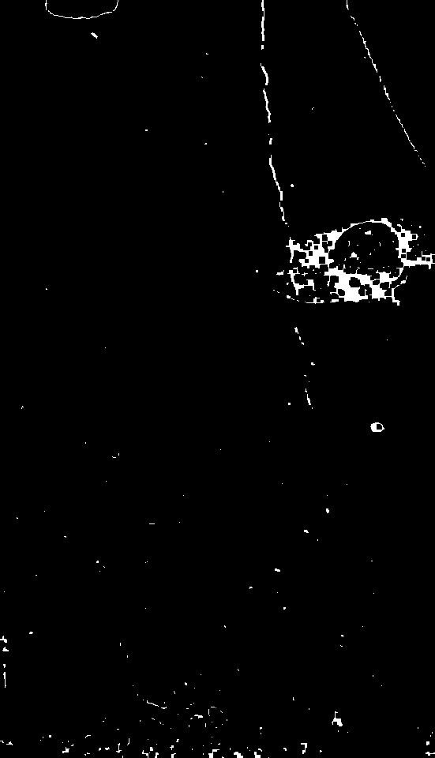

##
き裂を測定し，絵描きする．

## source code:
https://stackoverflow.com/questions/57089115/background-texture-pattern-removal-before-crack-detection-with-opencv

## cv2
cv2処理前のコンクリート図
cv2処理後のひび割れ図
source code:https://answers.opencv.org/question/205458/using-opencv-python-to-detect-concrete-cracks/

<!-- 

  

 -->

cv2処理前のコンクリート図    | cv2処理後のひび割れ図 
:-------------------------:|:-------------------------:
  |  
