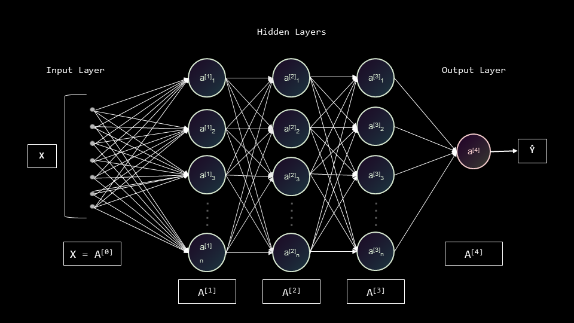
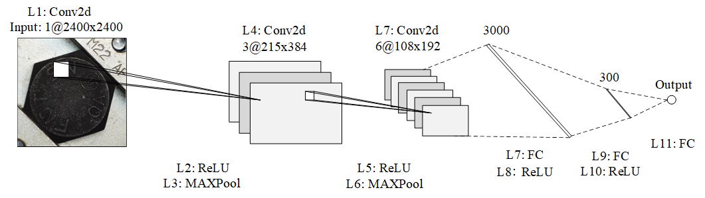
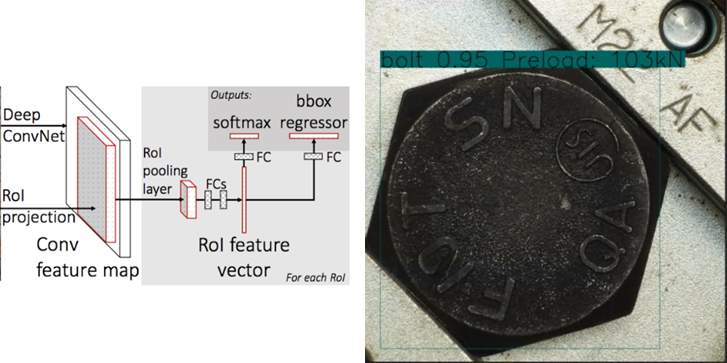

# NN network

# BPNN (Matlab, Pytorch)
BackPropagation Neural Network (BPNN)

## Train phase
Input: parameter (number) and Turelabel (Predictive value)

## Test Phase
Input: Parameter,  
Output: predevtive value, 
Erro: (Predective value, Ture label)

## Valid phase

Example
Use roughness value to evaluate the slip strength reduction.
BPNN
[(Use matlab)](https://github.com/ChenYu-K/Data-Processing/blob/7d6f18b26541e2dca5fdfdfc1d557058742c3a57/Neural%20Network/BPNN-slip%20coefficient.m)   
[(Use Pytorch)](https://github.com/ChenYu-K/Data-Processing/blob/main/Neural%20Network/ANN_train.py)

# CNN (Pytorch)
Use Resnet and Obeject detective to check the bolt axial force and bolt head.

